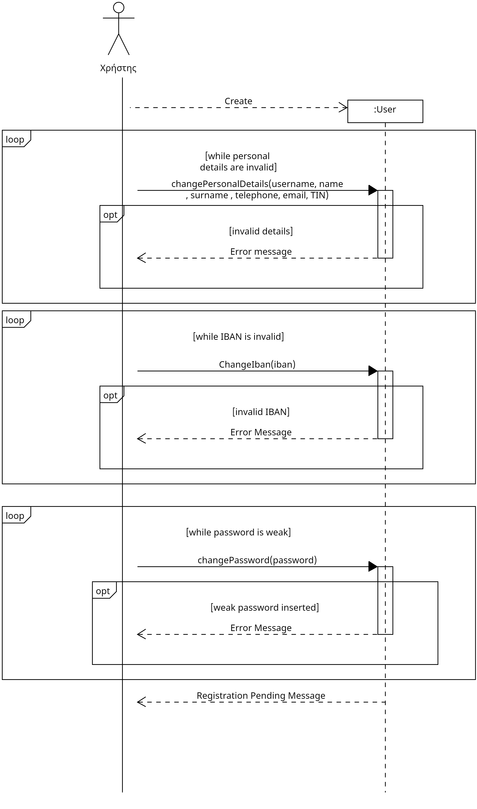
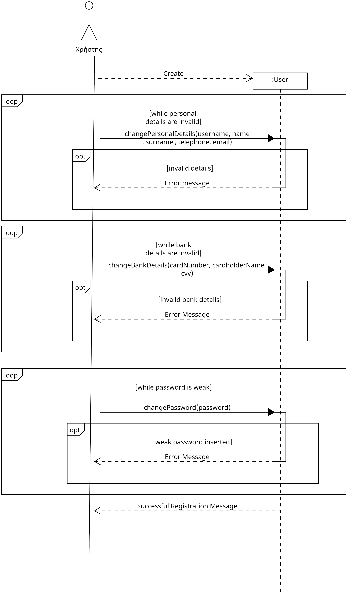
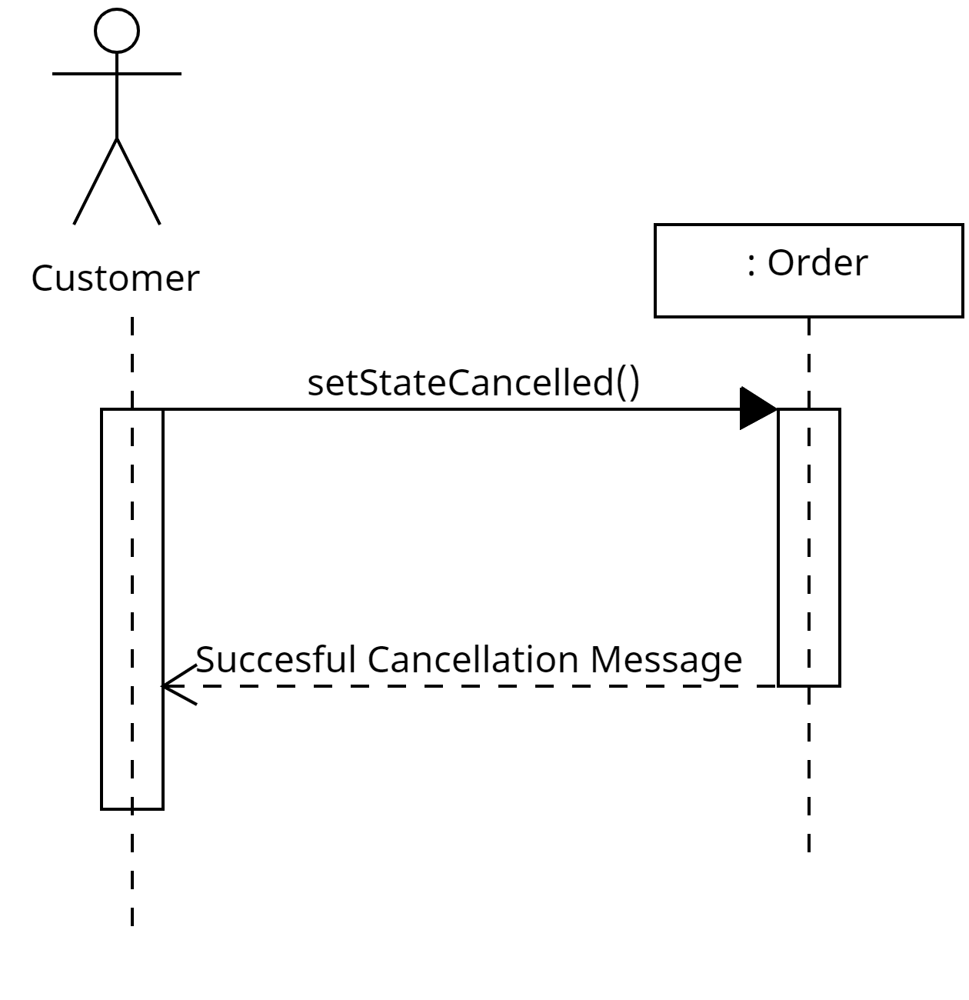
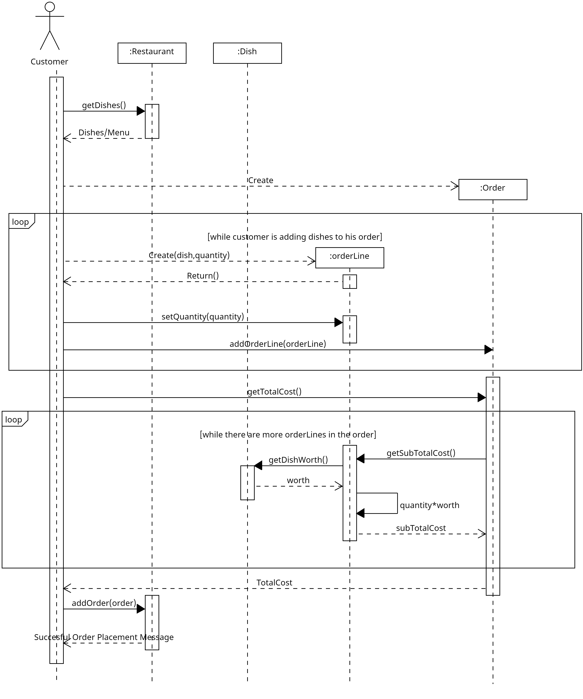
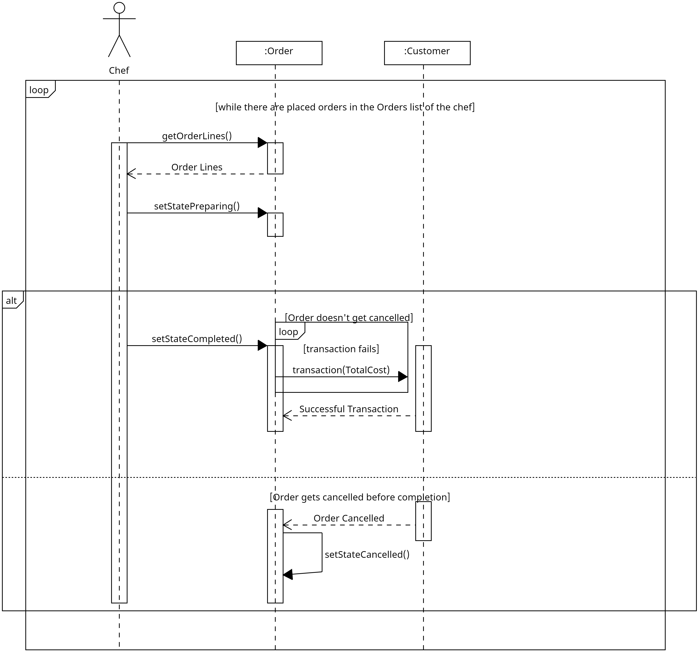
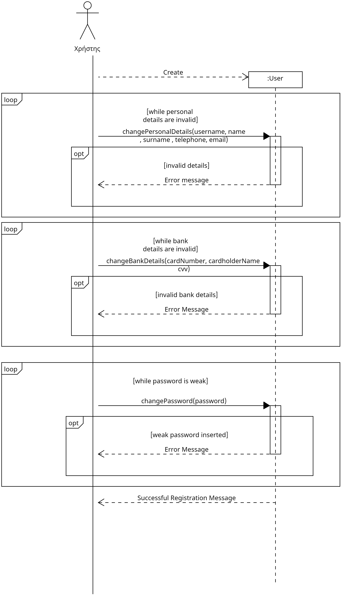

# **R3 Design and implementation of the logic of the domain.**
## 3.1 **Class Diagram**
## [class diagram](docs/uml/Class%20Diagram/class%20diagram.uxf)

## **Sequence diagrams**
 ## [Chef signup sequence diagram](docs/uml/Sequence_diagrams.uxf/R3_chef_Signup_sequence_diagram.uxf)

## [Customer signup sequence diagram](docs/uml/Sequence_diagrams.uxf/R3_Customer_Signup_sequence_diagram.uxf)

## [Order cancellation sequence diagram](docs/uml/Sequence_diagrams.uxf/R3_order_cancellation_seq_diagram.uxf)

## [Order placing sequence diagram](docs/uml/Sequence_diagrams.uxf/R3_Order_placing_sequence_diagram.uxf)

## [order processing sequence diagram](docs/uml/Sequence_diagrams.uxf/R3_Order_Processing_sequence_diagram.uxf)

## [owner signup sequence diagram](docs/uml/Sequence_diagrams.uxf/R3_owner_signup_sequence_diagram.uxf)

## 3.2 **Implementation of the logic of the domain in java**

## [link to java package](app/src/main/java/gr/aueb/softeng/team08/)

## 3.3 **Automated Tests in Junit**
## [link to test package](app/src/test/java/gr/aueb/softeng/team08/)

## 3.4 **Coverage Reports**

## [link to coverage reports](docs/Junit%20Test%20Coverage%20Report/)